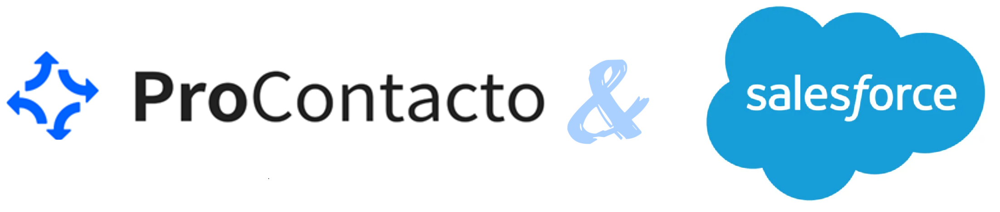
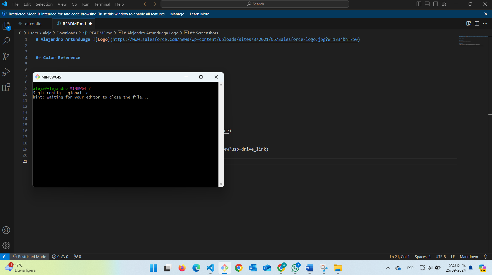

# Alejandro Artunduaga


## Ejercicio 1



## Ejercicio 2

Pregunta: Las siguientes preguntas están diseñadas para evaluar la comprensión del protocolo HTTP. Estas preguntas son independientes del lenguaje de programación, con el objetivo de profundizar en los conceptos fundamentales del estándar:

1.	#### ¿Qué es un servidor HTTP? 
    Los servidores *__HTTP__* son componentes esenciales en la arquitectura web que proporcionan servicios de alojamiento y entrega de contenido. Además de gestionar solicitudes y respuestas, podemos ofrecer funciones adicionales como autenticación, autorización y manejo de sesiones.

2.	#### ¿Qué son los verbos HTTP? Mencionar los más conocidos.
    Cada verbo *__HTTP__* tiene un propósito específico y determina la forma en que el servidor debe procesar una solicitud. Por ejemplo, un verbo puede solicitar la recuperación de datos, mientras que otro puede indicar que se deben enviar o modificar datos en el servidor. A continuación, vemos los más utilizados:

| Método HTTP            |Descripción                                                       
| ----------------- | ------------------------------------------------------------------ |
| GET   | Se utiliza para recuperar datos sin modificar el recurso.|
| POST  | Sirve para crear o modificar un recurso.|
| PUT   | Se utiliza para actualizar o crear nuevos recursos.|
| DELETE| Sirve para eliminar recursos en el servidor.|
| PATCH | Sirve para modificar parcialmente un recurso. |
| HEAD  | Es útil para verificar si un recurso está disponible. |


3.	#### ¿Qué es un request y un response en una comunicación HTTP? ¿Qué son los headers?
    El *__request__* es una solicitud que se envía al servidor para realizar una función específica. El *__response__* es la respuesta que devuelve el servidor, dependiendo del resultado. Los headers sirven para proporcionar características de cada una de las respuestas, brindando más información sobre ellas, tanto en el request como en el response.

4.	#### ¿Qué es un queryString? (En el contexto de una url)
    
    Es una parte de la URL que contiene datos que se envían al servidor para modificar o filtrar la respuesta. Cuando observamos una URL, es la parte que se presenta después del signo "?".
Ejemplo: <https://www.youtube.com/results?search_query=correlacion+en+excel>

5.	#### ¿Qué es el responseCode? ¿Qué significado tiene los posibles valores devueltos?
    Es el número enviado por el servidor que recibe de vuelta el cliente según la solicitud. Con este número se sabrá si la solicitud fue exitosa, errónea o requiere una modificación.

| Valor             |Característica                                                       
| ----------------- | ------------------------------------------------------------------ |
| 1xx (Informativos)   | La solicitud fue recibida y está en proceso.  |
| 2xx (Éxito)      | La solicitud se ha procesado con éxito. |
| 3xx (Redirección)  | Se requiere una acción adicional por parte del cliente para completar la solicitud.      |
| 4xx (Errores del Cliente)| Hubo un error en la solicitud del cliente.|
| 5xx (Errores del Servidor)     | Hubo un error en el servidor al procesar la solicitud.|

6.	#### ¿Cómo se envía la data en un Get y cómo en un POST? 
    Cuando realizamos una solicitud GET, los datos van incluidos al final de la URL en forma de query string, después del signo "?", con pares clave-valor separados por el símbolo "&".

    Ejemplo: https://ejemplo.com/buscar?query=musica&categoria=vallenato


7.	#### ¿Qué verbo http utiliza el navegador cuando accedemos a una página?
    El verbo que utiliza una página cuando accedemos desde el navegador es HTTP GET. Este también se utiliza cuando se sigue un enlace.

8.	#### Explicar brevemente qué son las estructuras de datos JSON y XML dando ejemplo de estructuras posibles.
    __*Repuesta:*__ JSON es más conciso y fácil de leer, mientras que XML tiene una estructura más compleja con etiquetas. JSON se usa comúnmente en aplicaciones web modernas, en comparación con XML, que generalmente se utiliza para sistemas más antiguos.

## Estructura JSON

```json
{
  "nombre": "Carlos García",
  "edad": 40,
  "ciudad": "Medellín",
  "hobbies": ["ajedrez", "ciclismo", "mentoría"],
  "experiencia": "Senior",
  "lenguajes": ["Java", "Python", "JavaScript"],
  "certificaciones": {
    "AWS": "Certified Solutions Architect",
    "Salesforce": "Certified Administrator"
  }
}

```     
## Estructura XML


```xml
<programador>
  <nombre>Carlos García</nombre>
  <edad>40</edad>
  <ciudad>Medellín</ciudad>
  <hobbies>
    <hobby>ajedrez</hobby>
    <hobby>ciclismo</hobby>
    <hobby>mentoría</hobby>
  </hobbies>
  <experiencia>Senior</experiencia>
  <lenguajes>
    <lenguaje>Java</lenguaje>
    <lenguaje>Python</lenguaje>
    <lenguaje>JavaScript</lenguaje>
  </lenguajes>
  <certificaciones>
    <certificacion>AWS: Certified Solutions Architect</certificacion>
    <certificacion>Salesforce: Certified Administrator</certificacion>
  </certificaciones>
</programador>

```   

9.	#### Explicar brevemente el estándar SOAP
    __*Repuesta:*__ SOAP es un protocolo de mensajería que permite la comunicación entre aplicaciones distribuidas a través de redes, utilizando formato XML. Dada su robustez y nivel de seguridad, se emplea en sectores que requieren alta protección de datos, como bancos, hospitales y servicios de telecomunicaciones. Sin embargo, SOAP es considerado más complejo que REST, que requiere menos mantenimiento y esfuerzo. Esto hace que los clientes que no necesitan altos niveles de seguridad ni transacciones complejas opten por utilizar REST.

10.	#### Explicar brevemente el estándar REST Full
    __*Repuesta:*__ se refiere al estilo arquitectónico que sigue ciertos principios y restricciones para diseñar servicios web. Se basa en conceptos como la representación de recursos, la utilización de métodos HTTP y la separación entre cliente y servidor.

11.	#### ¿Qué son los headers en un request? ¿Para qué se utiliza el key Content-type en un header?
    __*Repuesta:*__ Los headers en un request son elementos clave que proporcionan información adicional sobre la solicitud que se está haciendo a un servidor. Se envían junto con la solicitud HTTP para obtener datos adicionales.

El key Content-Type es el que le indica al servidor cómo debe interpretar los datos que recibe, por ejemplo, application/json ó text/html. Así se podrá garantizar una comunicación efectiva entre el cliente y el servidor.

## Ejercicio 3

1.	Se realiza una solicitud GET a la URL:

<https://procontacto-reclutamiento-default-rtdb.firebaseio.com/contacts.json>


2.	Se realiza una solicitud POST a la URL anterior con el cuerpo:


```json
{
  "name":"Tu nombre",
  "email":tunombre.tuapellido@procontacto.com.mx
}

```


3.	Realizar nuevamente una solicitud GET a la URL: 

<https://procontacto-reclutamiento-default-rtdb.firebaseio.com/contacts.json>


### Comparación de los Resultados

*__Punto 1:__* Se pueden observar los datos de los contactos que están en la base de datos.


*__Punto 2:__* Este request nos muestra la tabla actualizada después de haber agregado un usuario adicional.

## Ejercicio 4

Conceptos sobre los datos almacenados en Salesforce:

__1.__ *Lead:* Representa una persona o empresa que ha mostrado interés en los productos o servicios pero que aún no ha sido calificada como cliente.

__2.__ *Account:* Representa a las empresa o los individuos con los que se tienen relaciones comerciales.

__3.__ *Contact:* Representa una persona específica de una cuenta  de empresa o cliente.

__4.__ *Opportunity:* Representa los posibles acuerdos comerciales en los que se están trabajando.

__5.__ *Product:* Representa un producto o servicio que la empresa comercializa .

__6.__ *PriceBook:* Es la lista de productos con los precios.

__7.__ *Quote:* Representa una propuesta de venta que incluye los precios y los productos.

__8.__  *Asset:* Es lo que representa un producto vendido y que ya esta en poder del cliente.

__9.__ *Case:* Representa una solicitud de soporte o incidencia presentada por un cliente.

__10.__ *Article:* Son documentos o guías que contienen información útil para resolver problemas o consultas frecuentes.

## Ejercicio 5


## Ejercicio 6

### Soluciones de Salesforce

*A.	¿Qué es Salesforce?*
Salesforce es una plataforma (CRM) que ayuda a las empresas no solo a gestionar sus relaciones con los clientes, sino también en actividades como marketing y servicio al cliente. Tiene muchas herramientas que funcionan para la automatización de tareas y el análisis de datos. También sirve para las gestiones internas de la empresa, como la contratación de personal y otras actividades.

*B.	¿Qué es Sales Cloud?*
Sales Cloud es una solución diseñada por Salesforce que fue creada para ayudar a los equipos de ventas en la gestión de oportunidades, ingresos y automatización de procesos de ventas. Entre las herramientas están la gestión de contactos, la automatización de tareas, los informes y análisis, las oportunidades y la gestión de campañas. Esta herramienta ayuda a las empresas a cerrar negocios y ser más eficientes.


*C.	¿Qué es Service Cloud?*
Es una herramienta que se enfoca en la atención al cliente y soporte. Ayuda a las empresas a gestionar los casos de los clientes, brindando también soporte por canales como teléfono, correo electrónico, chat y redes sociales. Con esto, se mejora la experiencia del cliente. Además, incluye herramientas para la automatización de procesos, la gestión de solicitudes, bases de datos de conocimiento y analítica, lo que permite a los empleados resolver problemas de manera más eficiente y, así, mejorar la experiencia del cliente.


*D.	¿Qué es Health Cloud?*
Esta es la plataforma que se creó específicamente para la industria de la salud. Cuenta con herramientas que ayudan en la atención de pacientes, empleados y proveedores. Esta solución permite a las organizaciones gestionar la información de los pacientes, coordinar la atención y personalizar la experiencia de los mismos. Además, cumple con las normativas de calidad y seguridad requeridas.

*E.	¿Qué es Marketing Cloud?*
Esta es la solución de Salesforce para la automatización en marketing y la gestión de campañas. Esta herramienta cuenta con funcionalidades que permiten una buena gestión de la comunicación con los clientes. Además, incluye funciones de segmentación, análisis de datos y personalización. Le permite a las empresas crear campañas más efectivas y dirigidas, mejorando así la experiencia del cliente.

### Funcionalidades de Salesforce

*A. ¿Qué es un Record Type?* Se utiliza para los diferentes tipos de visualizaciones y procesos del mismo objeto. Permite a los usuarios definir diferentes conjuntos de valores, diseños de página y procesos de negocio, dependiendo de los distintos tipos de registro que están en el mismo objeto.

*B. ¿Qué es un Report Type?* Esta es una estructura sobre la cual se basa un informe en Salesforce. Permite crear tipos de informes personalizados que pueden incluir varios objetos y las relaciones entre ellos.

*C. ¿Qué es un Page Layout?* Es el diseño de un registro en Salesforce. Controla qué campos, secciones, botones, enlaces y listas relacionadas son visibles para los usuarios al visualizar o editar un registro. Estos pueden ser personalizados por los administradores.

*D. ¿Qué es un Compact Layout?* Define cómo se van a visualizar los campos clave de un registro en la vista resumida, como en las tarjetas de registro en las aplicaciones móviles o en la parte superior de la página de registro en Lightning Experience. Esto permite visualizar la información más esencial de un vistazo, sin tener que abrir el registro completo.

*E. ¿Qué es un Perfil?* Este es que define los permisos a los que un usuario tiene acceso, como los objetos que puede ver, editar, eliminar o crear. También puede controlar aspectos como el acceso a campos, aplicaciones, pestañas y páginas de Visualforce. Un perfil garantiza que un usuario tenga acceso a la información y funcionalidades que son relevantes para su rol.

*F. ¿Qué es un Rol?* Este es el que define los permisos a los cuales un usuario tiene acceso, como los objetos que puede ver, editar, eliminar o crear. También puede controlar aspectos como el acceso a campos, aplicaciones, pestañas y páginas de visualforce. Un perfil es el que garantiza que un usuario tenga acceso a la información y funcionalidades que son relevantes para su rol. 

*G. ¿Qué es una Validation Rule?* Se utiliza para verificar que los datos ingresados en un registro cumplan con ciertas condiciones necesarias o criterios antes de que se guarden. Si la regla de validación se incumple, muestra un mensaje de error y no permite que el usuario guarde el registro hasta que los datos sean corregidos.

*H. ¿Qué diferencia hay entre una relación Master-Detail y Lookup?*

* Master-Detail: Es una relación más estricta en la que el registro detallado depende completamente del maestro. Si se elimina el registro maestro, también se eliminan los registros detallados. Además, esta relación permite la herencia de permisos y la compartición de la propiedad del registro.

* Lookup: En este caso, un registro puede existir independientemente del registro al que está asociado. No hay dependencia de eliminación y, en no todos los casos, los permisos se heredan.

*I. ¿Qué es un Sandbox?*  Es un entorno de desarrollo y pruebas que está separado del entorno de producción. Los administradores y desarrolladores lo utilizan para probar nuevas funcionalidades, desarrollos y configuraciones sin afectar los datos reales ni los procesos en el sistema productivo.

*J. ¿Qué es un ChangeSet?*  Es un conjunto de configuraciones y componentes que se pueden mover de un ambiente Salesforce a otro, generalmente desde un sandbox hacia producción o entre sandboxes.

*K. ¿Para qué sirve el Import Wizard de Salesforce?*  Permite cargar datos en masa en Salesforce de una manera fácil. Soporta la importación de registros para varios objetos estándar, como contactos, cuentas, leads y objetos personalizados. Ofrece una interfaz guiada para mapear los campos y detectar duplicados.

*L. ¿Para qué sirve la funcionalidad Web to Lead?* Esta funcionalidad permite capturar la información de clientes potenciales desde un formulario web y crear automáticamente un registro de lead en Salesforce. Es útil para poder recopilar los datos de posibles clientes que visitan un sitio web y están interesados en los productos o servicios de la empresa.

*M. ¿Para qué sirve la funcionalidad Web to Case?* Permite a las empresas crear casos de servicio al cliente desde formularios web. En el momento en que un cliente envía un formulario con una consulta o problema desde el sitio web, se genera automáticamente un caso, lo que permite a los equipos de soporte gestionarlo dentro de la plataforma.

*N. ¿Para qué sirve la funcionalidad Omnichannel?* Omnichannel es una herramienta de Salesforce que permite gestionar de manera eficiente la asignación de casos, leads y otros elementos de trabajo a los agentes disponibles, en función de su capacidad y habilidades. Facilita la distribución automática de trabajo a través de diferentes canales, como correo, chat, redes sociales, etc. 

*O. ¿Para qué sirve la funcionalidad Chatter?* Esta es la herramienta de colaboración social interna que tiene Salesforce. Permite a los usuarios de la plataforma compartir archivos, enviar mensajes, hacer preguntas, y colaborar en tiempo real dentro de Salesforce. Chatter mejora la comunicación entre equipos y facilita la colaboración sobre proyectos y registros. 

### Conceptos Generales

*A. ¿Qué significa SaaS?*
Este es un modelo de distribución de software donde las aplicaciones se alojan en la nube y se ofrecen a los usuarios a través de Internet. De esta manera, los usuarios no necesitan instalar ni mantener el software en sus dispositivos; en su lugar, acceden a él mediante un navegador web. Este modelo permite actualizaciones automáticas, escalabilidad y reducción de costos de infraestructura.

*B. ¿Salesforce es SaaS?* Sí, es una SaaS, ya que ofrece una plataforma de gestión de relaciones con clientes (CRM) y otros servicios en la nube. Esto permite que los procesos de ventas, marketing y servicio al cliente se realicen sin necesidad de instalar software localmente.

*C. ¿Qué significa que una solución sea Cloud?* Esto se refiere a soluciones que se realizan en servidores remotos y se puede acceder por medio de internet. Lo que significa que los usuarios puedan acceder a los sistemas necesarios desde cualquier lugar y en el momento que lo requieran desde que tengan una conexión a internet.

*D. ¿Qué significa que una solución sea On-Premise?* Esta solución se refiere a software que se instala y opera en los servidores y equipos de la organización, y no en la nube. Las empresas son responsables tanto de la gestión informática como de la infraestructura tecnológica. Este modelo puede ofrecer un mayor control sobre los datos, pero también requiere inversiones más altas en infraestructura y recursos de TI.

*E. ¿Qué es un pipeline de ventas?*
Es una representación visual del proceso de ventas, que muestra las etapas por las que pasan las oportunidades de ventas desde la generación de leads hasta el cierre de una venta. Ayuda a los equipos de ventas a gestionar y prever sus actividades, identificar cuellos de botella y optimizar el proceso de ventas.

F. ¿Qué es un funnel de ventas?* Un funnel de ventas es un modelo que representa las etapas del viaje del cliente desde que tiene interés de un producto o servicio hasta que realiza una compra. Se visualiza como un embudo porque hay muchos más leads en la parte superior que clientes al final. Ayuda a las empresas a entender y analizar el comportamiento de los clientes en cada etapa del proceso.

*G. ¿Qué significa Customer Experience?* Se refiere a la percepción general que un cliente tiene de una marca, producto o servicio a por la experiencia. Incluye todos los puntos de contacto, desde la publicidad y la compra hasta el servicio al cliente y el uso del producto. Una buena experiencia del cliente es crucial para la satisfacción y la fidelización.

*H. ¿Qué significa omnicanalidad?* Es un enfoque en marketing y ventas que busca ofrecer una experiencia de cliente integrada y coherente a través de todos los canales y puntos de contacto, ya sea en línea o fuera de línea. Esto significa que los clientes pueden interactuar con la empresa a través de múltiples canales (sitio web, redes sociales, tiendas físicas, atención telefónica) y recibir una experiencia fluida y continua.

*¿Qué significa que un negocio sea B2B? ¿Qué significa que un negocio sea B2C? ¿Qué es un KPI? 

* __B2B__ Se refiere a negocios que venden productos o servicios a otras empresas. Por ejemplo, un proveedor de equipos de respaldo de TI que vende a empresas que tienen actividades en el área de CRM.

* __B2C__ Se refiere a los negocios que realizan transacciones directamente con los consumidores finales. Un ejemplo sería una tienda de tecnología que vende celulares a las personas de una comunidad.

* __KPI__ Es una métrica utilizada para medir el desempeño de una empresa según sus objetivos estratégicos. Los KPIs ayudan a las organizaciones a evaluar su éxito y tomar decisiones según la información obtenida.

*J. ¿Qué es una API y en qué se diferencia de una Rest API?*

* Una API es un conjunto de reglas y protocolos que permite que diferentes aplicaciones se puedan comunicar entre sí. Proporciona una interfaz para interactuar con aplicaciones y servicios.

* Una REST API es un tipo específico de API que sigue principios arquitectónicos REST. Utiliza HTTP para realizar operaciones como GET, POST, PUT y DELETE, y suele retornar datos en formato JSON o XML. Las REST APIs son populares por su simplicidad y escalabilidad. 

* K. ¿Qué es un Proceso Batch?* Un proceso batch es un método de procesamiento de datos donde se agrupan múltiples tareas o transacciones y se ejecutan en conjunto en un solo lote, en lugar de procesarlas individualmente. Esto puede ser útil para operaciones que no requieren interacción inmediata y que pueden ejecutarse durante períodos de baja actividad, como por ejemplo la actualización de bases de datos.

* L. ¿Qué es Kanban?* Es una metodología de desarrollo ágil, considerada una de las más utilizadas después de SCRUM. En esta metodología, se utilizan tarjetas en un tablero para visualizar las actividades y su progreso en las diferentes etapas.

* M. ¿Qué es un ERP?* Este es un sistema empresarial que integra tanto los procesos como las funciones de negocio en una sola plataforma. Este incluye módulos que abarcan finanzas, recursos humanos, cadena de proveedores, producción, ventas y más.

* N. ¿Salesforce es un ERP?* Salesforce tiene una parte de ERP, pero su función principal son las relaciones con los clientes. Por la tecnología implementada por Salesforce, se puede ver que está por encima de las funcionalidades de un ERP. Aunque también podemos integrar Salesforce con un ERP para tener un sistema más robusto y completo.


## Ejercicio 7

```
trigger UpdateEmailOnContact1 on Contact (after insert, after update) {
    String employeeId = '-O7gHUgDfnG3e5WLm_BS';

    List<Contact> contactsToUpdate = new List<Contact>();

    for(Contact con : Trigger.new) {
        if(String.isBlank(con.idprocontacto__c)) {
            con.idprocontacto__c = employeeId;

            Http http = new Http();
            HttpRequest request = new HttpRequest();
            request.setEndpoint('https://procontacto-reclutamiento-default-rtdb.firebaseio.com/contacts.json');
            request.setMethod('GET');
            HttpResponse response = http.send(request);

            if (response.getStatusCode() == 200) {
                Map<String, Object> responseData = (Map<String, Object>) JSON.deserializeUntyped(response.getBody());

                for(String key : responseData.keySet()) {
                    Map<String, Object> contactData = (Map<String, Object>)responseData.get(key);

                    if(contactData.get('idprocontacto') == employeeId) {
                        con.Email = (String)contactData.get('email');
                        contactsToUpdate.add(con);
                        break;
                    }
                }
            }
        }
    }

    if(!contactsToUpdate.isEmpty()) {
        update contactsToUpdate;
    }
}

```

## Gracias.
